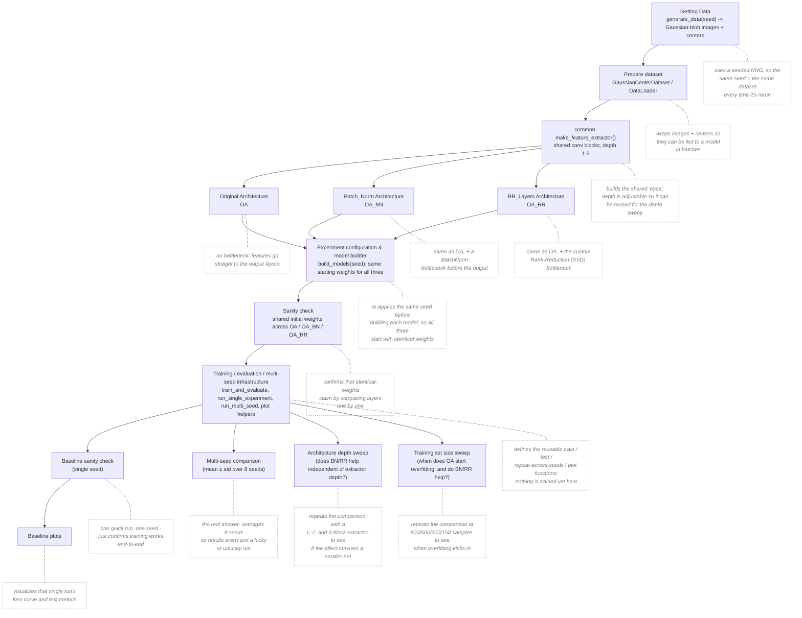

# OA vs BN vs RR

This notebook (`OA_vs_BN_vs_RR.ipynb`) compares three versions of the same small image-regression model. All three share the same convolutional feature extractor and the same final linear layers — they only differ in what sits between them (the "bottleneck"):

- **OA** — no bottleneck, features pass straight through.
- **OA_BN** — a BatchNorm layer (a standard normalization trick).
- **OA_RR** — a custom "Rank Reduction" layer that compresses features down to their most important directions (via SVD) before passing them on.

The task: look at an image of a 2D Gaussian blob and predict the (x, y) coordinates of its center.

Below is what each section of the notebook does, in plain English.

## Notebook flow

Everything above "Training / evaluation / multi-seed infrastructure" is setup (data, datasets, model definitions). Everything below it reuses the same toolbox to run four different comparisons: a quick one-seed check, the real multi-seed comparison, a sweep over feature-extractor depth, and a sweep over training-set size.

## Getting Data

Generates the Gaussian-blob images and their true center coordinates. Uses a seeded random generator so the same seed always produces the same dataset — important for making comparisons across runs reproducible instead of accidentally comparing different data each time.

## Prepare dataset

Wraps the generated images and coordinates into a PyTorch `Dataset`/`DataLoader` so they can be fed to a model in batches during training.

## common make_feature_extractor()

Builds the shared "eyes" of all three models — a stack of convolution + pooling blocks that shrink the image and extract features. The number of blocks (depth) is adjustable, so the same function can build a shallow or deep extractor later on.

## Original Architecture

Defines **OA**: feature extractor → straight into the final linear layers, no bottleneck. The baseline everything else is compared against.

## Batch_Norm Architecture

Defines **OA_BN**: same as OA, but with a BatchNorm layer inserted right before the final linear layers.

## RR_Layers Architecture

Defines **OA_RR**: same as OA, but with the custom Rank Reduction layer inserted before the final linear layers.

## Experiment configuration & model builder

Sets the shared settings used everywhere below (how many random seeds to test, how many training samples, how many epochs, learning rate, etc.), and defines `build_models`, which creates OA / OA_BN / OA_RR with **identical starting weights** for a given seed — so any difference in results comes from the bottleneck, not from lucky/unlucky initialization.

## Sanity check: shared initial weights across OA / OA_BN / OA_RR

Double-checks that `build_models` really did give all three models the same starting weights, by comparing their layers one by one.

## Training / evaluation / multi-seed infrastructure

The toolbox the rest of the notebook runs on — defines the reusable functions for training, testing, repeating an experiment across many random seeds, and plotting the results with error bars. Nothing is trained yet in this cell.

## Baseline sanity check (single seed)

Trains all three models once, on one seed, printing the loss every epoch — a quick "does everything work?" check before running the expensive multi-seed experiments.

## Baseline plots

Two plots for that single quick run: a bar chart of final test error per model, and a line chart of training loss over epochs.

## Multi-seed comparison (mean ± std)

The real comparison. Repeats the full experiment across 8 different random seeds and reports the **average result ± how much it varies** for each model, instead of trusting a single lucky/unlucky run. 

## (does BN/RR help independent of extractor depth?)

Repeats the full 8-seed comparison with a 1-block, 2-block, and 3-block (original) feature extractor, to check whether BatchNorm/RR's benefit holds up even with a much smaller network, or whether it's specific to the original architecture size.

## (when does OA start overfitting, and do BN/RR help?)

Repeats the full 8-seed comparison with 800, 500, 300, and 150 training images. Tracks the gap between training error and test error at each size — a growing gap is the signature of overfitting — to see when the plain model (OA) starts overfitting, and whether BatchNorm or RR delay or reduce it.
